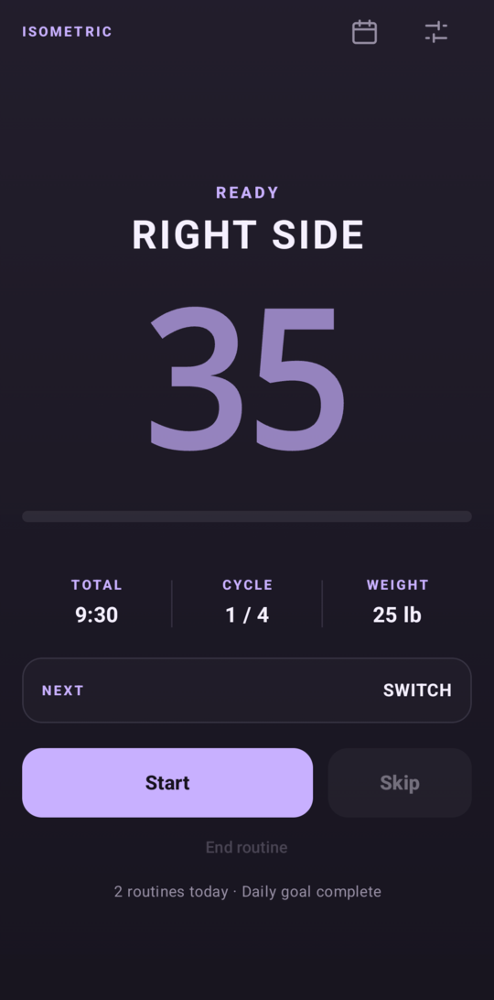
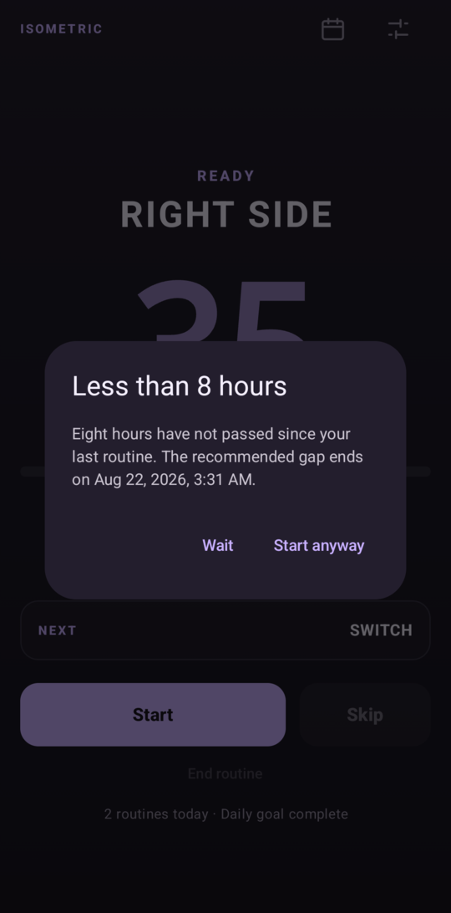
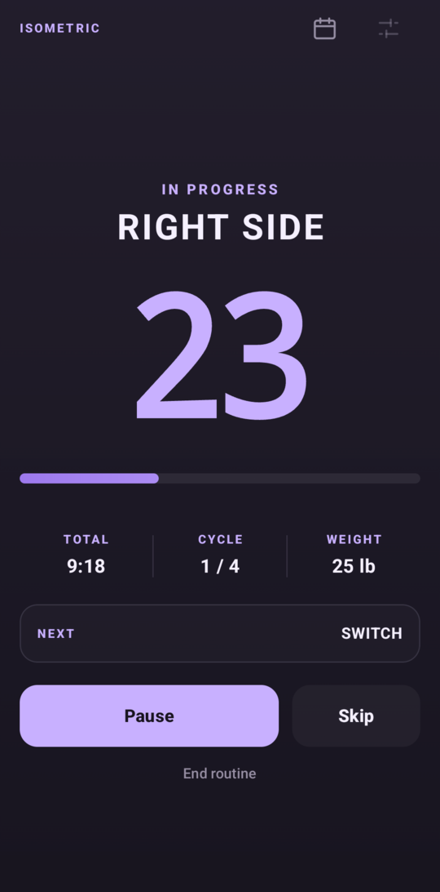
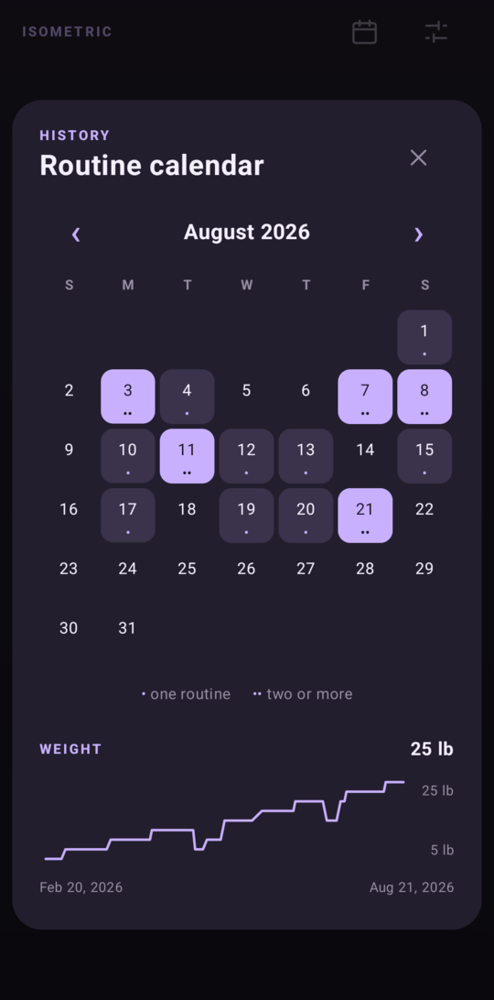

# Isometric Timer

A native Android isometric-hold interval timer — Kotlin and Compose, built to be
sideloaded onto a personal device rather than published. It sounds and vibrates
on every phase boundary, which matters because during a hold you are usually not
looking at the screen.

<table>
<tr>
<td width="25%"></td>
<td width="25%"></td>
<td width="25%"></td>
<td width="25%"></td>
</tr>
<tr>
<td align="center"><sub><b>Ready</b><br>Waiting to start</sub></td>
<td align="center"><sub><b>Too soon</b><br>The gap is advice, not a lock</sub></td>
<td align="center"><sub><b>Holding</b><br>The screen you don't look at</sub></td>
<td align="center"><sub><b>History</b><br>Completions and weight</sub></td>
</tr>
</table>

Everything lives in [`android/`](android/); see
[`android/README.md`](android/README.md) for the toolchain, the build and
install steps, and the design decisions behind the app.

## Build and install

```sh
cd android
./gradlew :app:testDebugUnitTest     # timing core, no device needed
./gradlew :app:assembleRelease       # -> app/build/outputs/apk/release/app-release.apk
adb install -r app/build/outputs/apk/release/app-release.apk
```

## Controls

- Tap **Start**, **Pause/Resume**, **Skip**, or **End routine**.
- Settings are stored only on the device. The defaults are 4 cycles, 35-second
  holds, a 5-second switch, and 90-second rests.
- Finishing a routine logs a completion; the calendar button shows the history
  and the recommended eight-hour gap before the next one.
